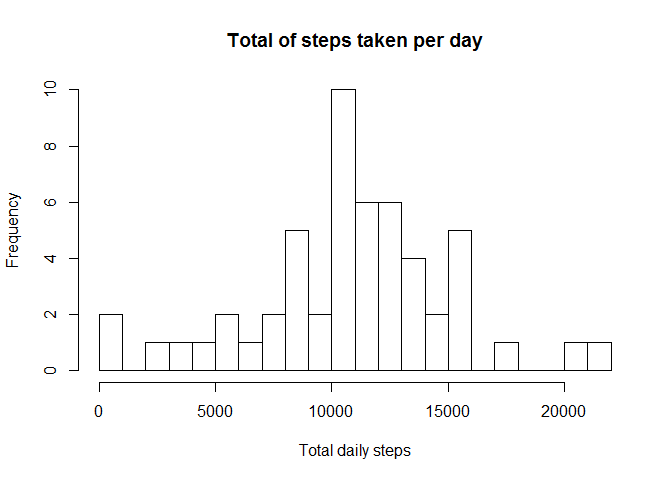
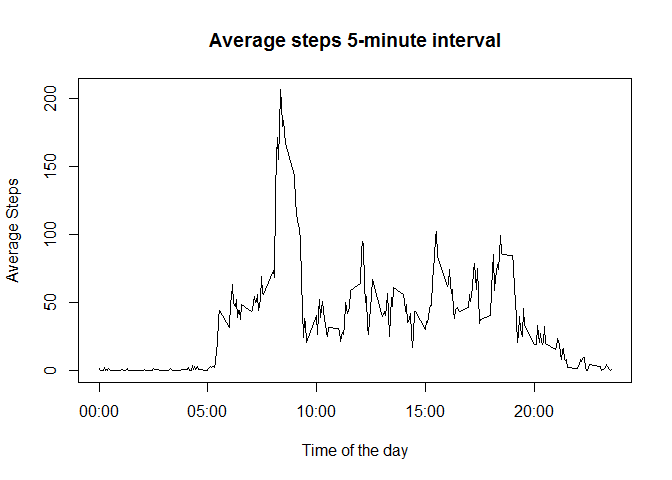
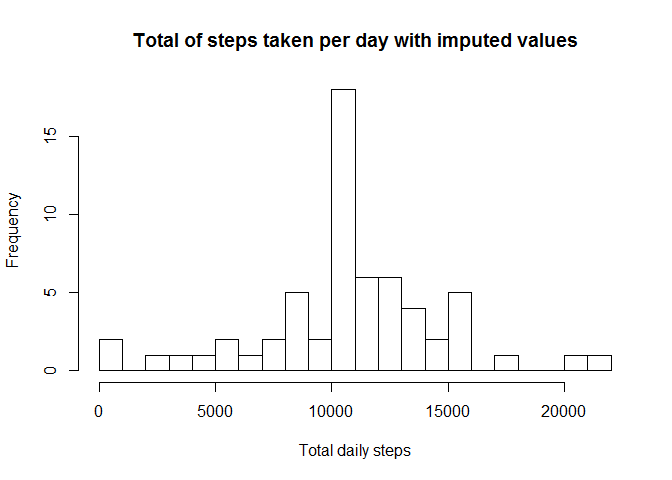

### Loading and preprocessing the data ###


**1. Load the data (using read.csv)**

**Note:** the file repdata-data-activity.zip is assumed to be in the working directory. File may be downloaded [here](https://d396qusza40orc.cloudfront.net/repdata%2Fdata%2Factivity.zip "repdata-data-activity file"). 


```r
unzip(zipfile="repdata-data-activity.zip")
activityData <-read.csv("activity.csv")
```

**2. Preprocess the data**

Check the data using str() method :

```r
str(activityData)
```

```
## 'data.frame':	17568 obs. of  3 variables:
##  $ steps   : int  NA NA NA NA NA NA NA NA NA NA ...
##  $ date    : Factor w/ 61 levels "2012-10-01","2012-10-02",..: 1 1 1 1 1 1 1 1 1 1 ...
##  $ interval: int  0 5 10 15 20 25 30 35 40 45 ...
```
Information shows date is a factor class and interval is a integer class.


Convert the date column to Date class and the interval column to Factor class.

```r
activityData$date <- as.Date(activityData$date, "%Y-%m-%d")
activityData$interval <- as.factor(activityData$interval)
```

Recheck the data using str() method :

```r
str(activityData)
```

```
## 'data.frame':	17568 obs. of  3 variables:
##  $ steps   : int  NA NA NA NA NA NA NA NA NA NA ...
##  $ date    : Date, format: "2012-10-01" "2012-10-01" ...
##  $ interval: Factor w/ 288 levels "0","5","10","15",..: 1 2 3 4 5 6 7 8 9 10 ...
```

### What is mean total number of steps taken per day? ###

**1. Calculate the total number of steps taken per day** 


```r
stepsByDay <- tapply(activityData$steps, activityData$date, sum)
```

**2. Make a histogram of the total number of steps taken each day** 


```r
hist(stepsByDay, main = "Total of steps taken per day", xlab = "Total daily steps", 
     breaks = 20)
```

 

**3. Calculate and report the mean and median of the total number of steps taken per day** 


```r
stepsByDayMean <- mean(stepsByDay, na.rm= TRUE)
stepsByDayMedian <- median(stepsByDay, na.rm= TRUE)
```
The resulting mean is **1.076619\times 10^{4}** and the median is **10765**.

### What is the average daily activity pattern?###
**1. Make a time series plot (i.e. type = "l") of the 5-minute interval (x-axis) and the average number of steps taken, averaged across all days (y-axis)** 


```r
#obtain the mean of the steps at each 5-min interval
intervalMean <- as.numeric(tapply(activityData$steps, activityData$interval, mean, na.rm=TRUE))
intervals <- data.frame(intervals = as.numeric(levels(activityData$interval)), intervalMean)

#details for formatting the x-axis labels
labels <- c("00:00", "05:00", "10:00", "15:00", "20:00")
labels.at <- seq(0,2000,500)
plot(intervals$intervals, intervals$intervalMean, type = "l", 
            main = "Average steps 5-minute interval", ylab = "Average Steps",
            xlab = "Time of the day", xaxt = "n")
#formatting the x-axis
axis(side = 1, at= labels.at, labels = labels)
```

 


**2. Which 5-minute interval, on average across all the days in the dataset, contains the maximum number of steps?** 


```r
maxSteps <- intervals[intervals$intervalMean == max(intervals$intervalMean),]
```
The 5-minute interval with the highest average number of steps corresponds to the interval in **835**  which has an average of  **206** steps.

### Imputing missing values###

**1. Calculate and report the total number of missing values in the dataset (i.e. the total number of rows with NAs)** 

Use the following code to tabulate the total number of missing values

```r
sum(is.na(activityData))
```
The total number of missing values are **2304**. 

**2. Devise a strategy for filling in all of the missing values in the dataset. The strategy does not need to be sophisticated. For example, you could use the mean/median for that day, or the mean for that 5-minute interval, etc.** 

Strategy would be to use the mean of that day to fill the missing values.

**3. Create a new dataset that is equal to the original dataset but with the missing data filled in.**

Using the impute function call in the Hmisc library

```r
#using the impute function call in the Hmisc library
library(Hmisc) 
```

```
## Warning: package 'Hmisc' was built under R version 3.2.1
```

```
## Warning: package 'Formula' was built under R version 3.2.1
```

```
## Warning: package 'ggplot2' was built under R version 3.2.1
```

```r
activityDataImputed <- activityData
activityDataImputed$steps <- impute(activityData$steps, fun=mean)
```

**4. Make a histogram of the total number of steps taken each day and Calculate and report the mean and median total number of steps taken per day. Do these values differ from the estimates from the first part of the assignment? What is the impact of imputing missing data on the estimates of the total daily number of steps? ** 

Make the histogram


```r
stepsByDayImputed <- tapply(activityDataImputed$steps, activityDataImputed$date, sum)
hist(stepsByDayImputed, main = "Total of steps taken per day with imputed values", xlab = "Total daily steps", 
     breaks = 20)
```

 

Tabulate the mean and median of the imputed data

```r
stepsByDayMeanImputed <- mean(stepsByDayImputed)
stepsByDayMedianImputed <- median(stepsByDayImputed)
```

Table of comparison as below shows while the mean values remains the same, the median has shifted to match the mean.  

Values  | Original dataset  | Imputed dataset 
------  | ----------------  | --------------- 
Mean    |1.076619\times 10^{4} | 1.076619\times 10^{4}
Median  |1.0765\times 10^{4} | 1.076619\times 10^{4}

Comparing both the histogram of the actual vs imputed datasets, it seems the impact of the imputed dataset has increased the peak. 

###Are there differences in activity patterns between weekdays and weekends?###

**1. Create a new factor variable in the dataset with two levels - "weekday" and "weekend" indicating whether a given date is a weekday or weekend day.** 


```r
activityDataImputed$dateType <- ifelse(as.POSIXlt(activityDataImputed$date)$wday %in% c(0,6), 'weekend', 'weekday')
```

**2. Make a panel plot containing a time series plot (i.e. type = "l") of the 5-minute interval (x-axis) and the average number of steps taken, averaged across all weekday days or weekend days (y-axis).** 


```r
#prepare the data for plotting - obtain the means by weekday and weekend
MeanSteps <- aggregate(activityDataImputed$steps,list(interval = activityDataImputed$interval, weekdays = activityDataImputed$dateType), mean)
names(MeanSteps)[3] <- "steps"

#format the required data columns to the correct data type for plotting
MeanSteps$weekdays <- as.factor(MeanSteps$weekdays)
MeanSteps$interval <- as.numeric(as.character(MeanSteps$interval))

#plotting the graphs
library(lattice)
xyplot(steps ~ interval | weekdays, data = MeanSteps, layout=c(1,2), type = "l")
```

 
